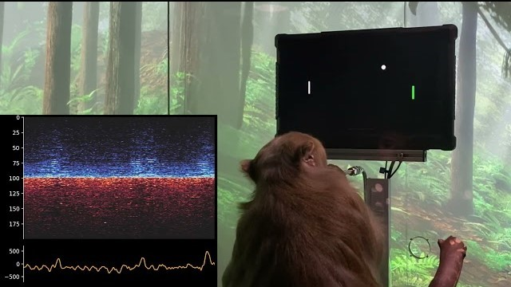

In 2016 Elon Musk, founder of Tesla & SpaceX, embarked on a project called Neuralink where they plan to help those with neurological diseases. Currently, they are creating a Brain Machine Interface that will allow humans to control devices with solely their mind and has potential to many more features like telepathy communication. 

# The Science

Before understanding what Neuralink is and the future it holds, we ought to discuss the science behind it

### The Human Brain
The human brain is made up of 86 billion neurons that are all connected to each other by synapses.[[1]](https://alleninstitute.org/what-we-do/brain-science/news-press/articles/5-unsolved-mysteries-about-brain) A Neuron is a cell that can be thought of as an electrical device that allows positive or negative ions to flow in or out of itself1. Neurons communicate by sending and receiving these electric signals, in which release small chemical neurotransmitters at the synapse.1 A neuron initiates an action potential when it receives the right amount of excitatory and inhibitory synaptic input. Action potentials are also referred to as 'spikes' because of the shape it produces when being recorded.

### Electrodes
Neuroscientists can monitor the neural activity from outside the brain, but those techniques lack detailed reports since it records millions of active neurons at once(Yongchen). Instead, Electrodes can be connected directly to the brain to produce high-level and fine-scale information by recording 'spikes' from individual neurons. Electrodes are placed near neurons to record and detect action potentials. These records allow for neuroscientists to decode the information represented by those cells, such as everything we feel, touch, think, or see., or do. 

### Neural Stimulation
 When small electric currents are delivered through the electrode, it will fire action potentials of other nearby neurons. If the neurons spike in the right temporal sequence then they can create a pattern for a particular desired sensation(Yongchen). Desired sensation could be seeing a visual image, hearing a certain tone, or the feel of holding an object in a particular hand. Neural Stimulation can cure or help those with a neurological diseases by reducing or eliminating certain pathological patterns that occur in that disease. A list of some of the common neurological diseases can be found below.
- Parkinson's Disease     
- Epilepsy
- Seizures 
- Alzheimer's
- Dementia
- Sclerosis

# Neuralink’s Approach

### Development
The initial goal that is stated on Neuralink's website, is to produce technology that helps those with paralysis "regain independence through the control of computers and mobile devices." Neuralink is currently building a BMI, brain machine interface, system to enable direct communication between digital devices and the human brain. Communication consists of information readout from the brain like controlling a device's mouse, keyboard, or touch screen. It will also support information to be written back into the brain like sense of touch. 

### The 'Link' Implant
The 'Link' is a surgically implanted device that will connect to thousands of neurons in the brain. The implant is a small sealed device that can stimulate and transmit neural signals with the attached ‘Neural Threads'. Neural Threads are micron-scale threads that are inserted into areas of the brain that control movement. Each thread contains many electrodes that will record neural activity for the device to decode and interpret the brains intentions("Neuralink Progress Update, Summer 2020"). This is done by mathematical models and adaptive algorithms that take advantage of its initial data on how the brain works. Eventually, the computer will use the interpreted commands to execute desired functions or tasks.

### Testing Link
To ensure safety, Neuralink will complete a great amount of testing before the first release. Elon Musk has already showed the success of the Link by demonstrating its capabilities with animals. One being a monkey where it played the game Pong with its mind. The monkey, Pager, was initially taught how to play the video game with a joystick while the Neuralink device was implanted in the brain.2 The device decoded the neural activity while the monkey performed different moves. After a few minutes, the joystick was removed and the monkey played the game with its mind by using the output of the decoder.2

Neuralink plans to test it on humans within the next year. When a user thinks about moving a certain body part or muscle, they device will decode the action potentials fired from those intentions. The users first goal would be to learn how to move a virtual mouse. Eventually, the user will be able to control more advanced devices once they get more practice and Neutralino’s adaptive decoding algorithms improve(Neuralink).

### Neuralink App
The app installed on an iOS device, would allow the user to control the phone from the just thinking of the desired actions. The app also plans to have a Bluetooth connection that would be able to control any device that can connect. The Neuralink app provides guides and exercises for the user to learn how to control the device. Not only can an iPhone be controlled, but with Bluetooth connection users can control any mouse, keyboard, or other Bluetooth devices.

# What The Future Holds 

Neuralink is currently focused on making medical devices for a wide range of neurological disorders. However, they expect to create new non-medical applications as they learn to communicate with more areas of the brain. The following is a list of potential applications that Elon Musk and his team showcased in August of 2020 and their thoughts regarding these possibilities. You can view the showcase [here](https://www.youtube.com/embed/DVvmgjBL74w).

### Visual Prothesis (Supervision)
  Essentially plug camera into visual cortex and stimulate thousands of electrodes to reproduce the visual image. Musk stated that Supervision could be achieved by adjusting the frequency and sensor, giving the user ultraviolet, infrared, or radar vision.
  
### Telepathy
  The brain puts a tremendous amount of its mental energy in translating thoughts into words and is often inefficient. Neuralink predicts to produce better communication by implementing the ability to send our true thoughts.
  
### Unlocking Creativity
 There is "a lot of untapped creativity" in each person due to the brains inefficient translation of thoughts. For an example, if someone thought of a beautiful detailed scene, it would take years for someone to craft or paint if they even had the ability to. With enough electrodes, those raw concepts could be decoded to "show people primitive versions of music or even 3D model for engineering.”
 
### Save Memories as Repositories
  Memories fade as time passes, even the ones we cherish the most. Neuralink proposed the possibility of saving memories in repositories like we do with music. A user would be able to go back and revisited the memory. This would also lead to solving cognitive disorders like Alzheimer’s.
  
### Eliminate Physical Pain
  There are many diseases that contribute a lot of pain to the patient, and even the treatments can be painful. Neuralink devices could play a crucial role in minimizing the physical pain felt by those with painful diseases.
  
###  Disease Prediction
   Not only will the device pick up on electrical signals in the brain, but chemical cues as well. Informing the user ahead of time will lead them to take early action and hopefully prevent the disease.
   
### Solve Mental Illness
  Device as potential into channeling into more regions of the brain where mental disorders originate in. This could lead to solving mental illnesses or eliminating a feeling for a certain period of time. For an example, eliminating fear when presenting in front of a class.

## Importance In The Future
Humans in a way are already cyborgs, we use our smartphones and computers every day that have become an extension of ourselves. Neuralink is extending that digital tertiary layer we already have. AI's intelligence is increasing at an exponential rate which raises many possible concerns for humanity. Musk stated that AI poses an "existential threat" to humanity and humans will eventually have to merge with AI. Neuralink is an opportunity to save us from the potential threats AI imposes by enabling humans to compete at the same level as super-intelligent machines.

To keep up with Neuralink and their progress, visit their website at https://neuralink.com/

### References

[1] “5 Unsolved Mysteries about the Brain.” Allen Institute, 14 Mar. 2019, https://alleninstitute.org/what-we-do/brain-science/news-press/articles/5-unsolved-mysteries-about-brain. 

[2] “Monkey MindPong.” YouTube, uploaded by Neuralink, 8 April 2021, https://youtu.be/rsCul1sp4hQ.

[3] "Neuralink Progress Update, Summer 2020." YouTube, uploaded by Neuralink, 28 August 2020, https://youtu.be/DVvmgjBL74w.

[4] “Neuralink.” Neuralink, 2021, https://neuralink.com/.

[5] Yongchen, Wang, and Guo Liang. “Nanomaterial-Enabled Neural Stimulation.” Frontiers in Neuroscience, vol. 10, 2016. 

 
